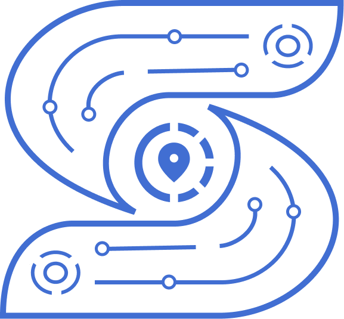
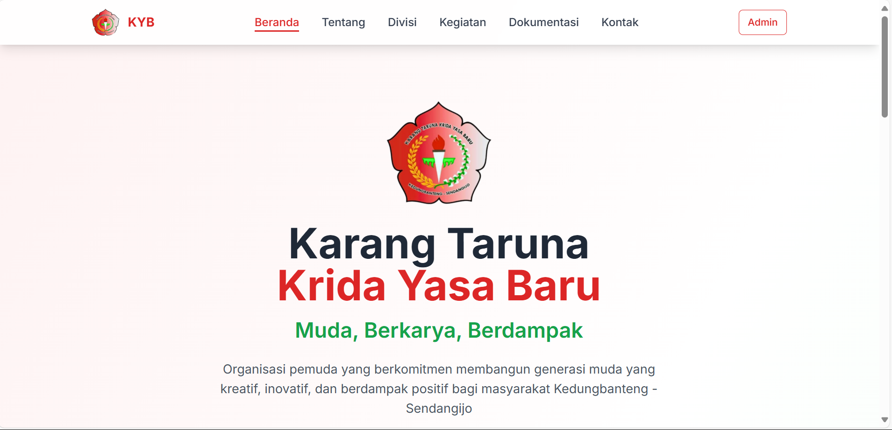
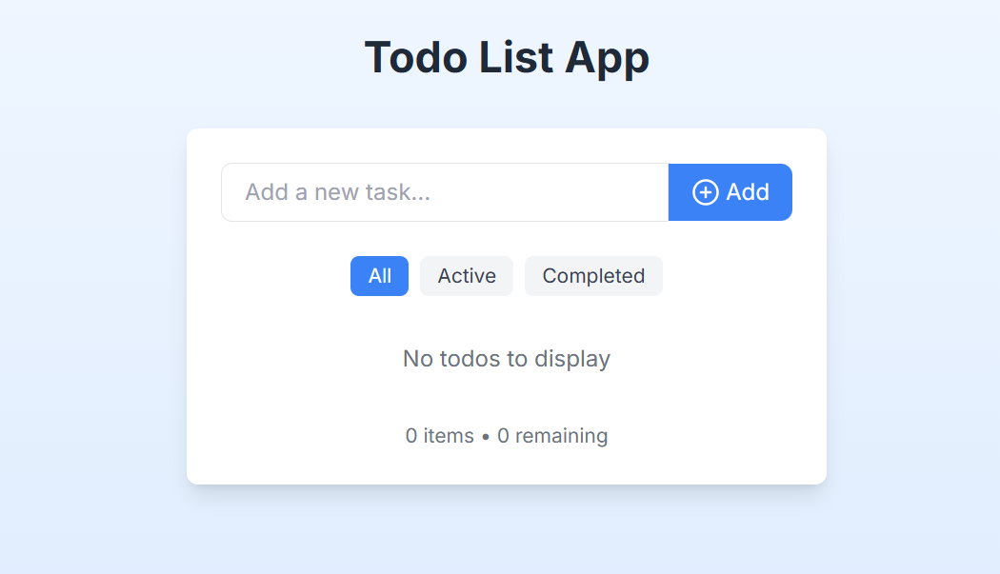

<!-- Header -->

  
  
<h3>📫 Get in Touch</h3>

  
  
  
  

  <h4>💬 "Always open to interesting conversations and collaboration opportunities!"</h4>
  

n=fadeIn&fontAlignY=30"/>
  
  

    
  

  
  

    
    
    
    
  

  
  

    
    
    
  

  

---

## 🔗 Quick Links

  
| 🎯 **Focus Areas** | 🛠️ **Current Stack** | 📚 **Learning** |
|:---:|:---:|:---:|
| Frontend Development | React, TypeScript | React Native |
| UI/UX Design | Figma, Tailwind CSS | Next.js |
| API Integration | RESTful APIs | GraphQL |

---

## 🧑‍💻 About Me

- 🎓 Informatics Student at **Politeknik Negeri Semarang**
- 💻 Front-End Developer focusing on **React** ecosystem and modern JavaScript
- 🎨 UI Designer with expertise in **clean, responsive designs**
- 🔄 Experience with RESTful APIs integration and state management
- 🌱 Currently exploring **React Native** for mobile & **NextJS** for server-side rendering
- 🧠 Passionate about component-driven development and micro-frontend architecture
- ⚡ Active contributor to open-source projects
- 🧩 Fun fact: I debug better when drinking coffee ☕️

### 🎯 Current Focus
- 🚀 Building scalable React applications
- 📱 Exploring mobile development with React Native
- 🎨 Mastering advanced CSS animations and micro-interactions
- 🔧 Learning backend technologies to become full-stack

---

## 🧰 Tech Stack

  
### Frontend Development

  

### Tools & Design

  

### Backend & Database

  

### Currently Learning

  

  
  

---

## 📈 GitHub Stats

  
  
  

    
    
  

  
  
  
  

---

## 🚀 Featured Projects

  
### 📱 Mobile & Web Applications

<table border="0" cellspacing="0" cellpadding="15">
  <tr>
    <td align="center" width="50%">
      
      <h3>📚 SIPADU - Attendance System</h3>
      
<em>Mobile application for streamlining faculty attendance tracking</em>

      

        
        
      

    </td>
    <td align="center" width="50%">
      
      <h3>🌐 KYB Group Portfolio</h3>
      
<em>Professional website for Karang Taruna youth community</em>

      

        
        
      

    </td>
  </tr>
  <tr>
    <td align="center" width="50%">
      
      <h3>✅ Smart Todo App</h3>
      
<em>Intuitive task management with React and LocalStorage</em>

      

        
        
      

    </td>
    <td align="center" width="50%">
      

        <h3>🚧 Coming Soon...</h3>
        
<em>Working on something amazing!</em>

        
      

    </td>
  </tr>
</table>

---

## � Achievements & Certifications

  
<table>
  <tr>
    <td align="center">
      
       <strong>Student Developer</strong>
       <em>Politeknik Negeri Semarang</em>
    </td>
    <td align="center">
      
       <strong>Frontend Specialist</strong>
       <em>React & Modern JavaScript</em>
    </td>
    <td align="center">
      
       <strong>UI/UX Designer</strong>
       <em>Figma & Design Systems</em>
    </td>
  </tr>
</table>

---

## �🌐 Let's Connect

  
  
  
  

---

<!-- Footer -->

  

