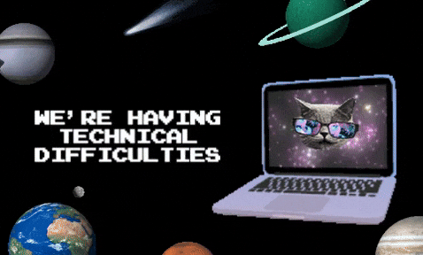

<div align="center">
  
</div>

<h1 align="center">
   
  Welcome to my Digital Playground
  
</h1>

<div align="center">
  
</div>

<p align="center">
  
</p>

<div align="center">
  
</div>

##  About Me

```javascript
const dannfrd = {
  code: ["Laravel", "TypeScript", "Python"],
  tools: ["React"],
  architecture: ["microservices", "event-driven", "serverless"],
  currentFocus: "Building scalable web applications with modern tech stacks",
  funFact: "I debug code like Pudgy hacks the Matrix"
};
```

<div align="center">
  
</div>

##  Tech Stack

<div align="center">
  
</div>

##  GitHub Analytics

<div align="center">
  
  
</div>

<div align="center">
  
</div>

##  Current Projects

<div align="center">
  <a href="#">
    
  </a>
  <a href="#">
    
  </a>
</div>

##  Connect with Me

<div align="center">
  <a href="https://twitter.com/USERNAME">
    
  </a>
  <a href="https://linkedin.com/in/USERNAME">
    
  </a>
  <a href="mailto:email@example.com">
    
  </a>
  <a href="https://discord.gg/USERNAME">
    
  </a>
</div>

<div align="center">
  <h3>🐧 Pudgy's Coding Adventures</h3>
  
  <p><i>When Pudgy isn't hacking the Matrix, he's building awesome software!</i></p>
</div>

<div align="center">
  
</div>